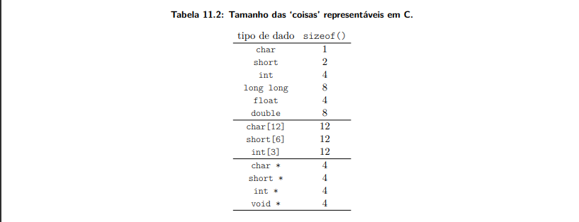

### Estruturas de dados em C: matriz, nada mais que um vetor multidimencional.

Pelo o que entendi aqui a gente vai discorrer sobre como eh a construcao e compisicao do que conhecemos de algumas estruturas em C e em Assemble, mas claso ambos na visao da memoria MIPS.  

Entenda aqui por *TED* como um tipo estruturado de dados, ou mesmo um tipo de dado, eh como eu quero representar os tipos basicos de variaveis e constantes representaveis em C, pode ser que em outra literatura autores nomeiem de outra forma, tudo bem? Pois bem! Em C existe a funcao chamada **sizeof()** que retorna a quantidade de bytes nescessarios para representar o respectivo *TED* entao fica atento que voce pode sim usar esse recurso durante a sua jornada.  

Outro ponto que devo apontar a voce eh que **ponteiros para qualquer *TED* possui exatamente o mesmo tamanho** independente de qual tipo de estrutura de dados ele seja, o ponteiro em si possui um tamanho definido.

Aqui na figura 11.4 vai mostrar um exemplo de como se comporta a alocacao em memoria. Para esse exemplo temos 3 vetores de tipos diferentes **char**, **short** e **int**.

E finalizando o assunto dessa imagem acima, elementos contiguos de vetores e estruturas de dados sao alocados sempre em enderecos contiguos, ou seja V[i+1] eh alocado no endereco seguinte a V[i]. O que voce deve entender eh que existe uma dependencia do proximo valor a ser indexado, e essa dependencia eh dada pelo atual endereco alocado, assim o endereco do 'elemento seguinte' depende do tipo dos elementos do vetor V.
