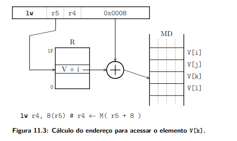

## Acesso a variaveis em memoria

Veja que os programas comuns do dia-a-dia fazem uso de um numero maior que os 32 registradores que conhecemos, entao para isso nos usamos o acesso e manipulacao de variaveis, estruturas de dados e vetores.  

Entenda que o MIPS os operandos de todas as instrucoes que operam sobre dados sao registradores, e por isso os operandos devem ser trazidos da memoria para que sejam utilizados.  

Esse tal MIPS eh uma memoria, um vetor com o tipo byte: M[2^32], que pelas contas dá 4 GBytes, cada endereco de mamoria eh um indice do vetor.  

Outra caracteristica eh que os bytes sao armazenados de maneira sequencia no vetor M[]. Para simplificar a interface do processador com a memoria, as referencias devem nescessariamente estar em *enderecos alinhados*.


## Tipos de instrucoes para acessar a memoria: *loads* e *stores*

Ambas possuem tamanhos: *byte, half word(2 bytes) e word(4 bytes)*. A instrucao lw(*load word*) copia o conteudo de uma **palavra em memoria para um registrador**, e o sw(*store word*) copia o conteudo de um **registrador para uma palavra na memoria**. O campo *desl16* é um inteiro representado em 16 bits.  

Exemplo:
```
lw      r1, desl16(r2)      # r1 <- M[ r2 + extSin(desl16) ]
sw      r3, desl16(r4)      # M[ r4 + extSin(desl16) ] <- r3
```  

O *endereco efetivo* é a soma do conteudo do *registrador base* (r2 e r4) com a constante estendida. Esse endereco efeito eh realmente o local em M ou um vetor V onde sera armazenado o resultada operacao. Lembrando que o deslocamento pode ser tanto negativo como positivo e quando o endereco efetivo eh menor que o apontado pelo registrador base, ou positivo, quando o endereco efetivo eh maior que o apontado pelo registrador base. Em outros momento a literatura tras consigo a notacao &(V[0]) para o endereco de um vetor.



```
C               assembly
i = V[k]        lw r4, 8(r5)
``` 

Tanto a imagem como o trecho de código em C e Assembly representam algo equivalente, o registrador r5 aponta para o endereco inicial do vetor V. Ao conteudo de r5 soma-se o deslocamento, que eh 2x4=8, e o endereco efetivo eh &(V[0])+8.  

A posicao do endereco efeito eh acessada na memoria e seu conteudo eh copiado para o registrador r4. Algo a ser destavado eh que o deslocamento com relacao a base do vetor( apontado por r5), eh de 8 bytes porque cada elemento do vetor ocupa queatro bytes consecutivos na memoria.
