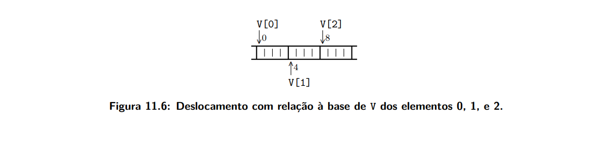

### Exemplos de estruturas de dados em C: vetores e matrizes.

**EXEMPLO 11.1**
```
C                           assemble
int V[NNN]                  la      r1, V           # r1 <- &(V[0]) 
...                         lw      r4, 4(r1)       # r4 <- M[r1 + 1*4]
V[0] = V[1] + V[2]*16       lw      r6, 8(r1)       # r6 <- M[r1 + 2*4]
                            sll     r6, r6, r4      # r6*16 = r6<<r4
                            add     r7, r4, r6      
                            sw      r7, 0(r1)       # M[r1 + 0*4] <- r4+r6
``` 

O trecho acima considera o acesso ao vetor de inteiros V, que mostra um exemplo em linguagem C e o equivalente em assemble. Destaca-se o deslocamento de 4 bytes para acessar os interios, haja vista o vetor ser de inteiros. Ao registrador r4 é atribuido o valor de V[1], ao r6 o valor de V[2], ao r7 o valor a ser armazenado em V[0]. Os comentarios mostram o calculo do *endereço efetivo* usando como base o V[0] inicial e usando o deslocamento de 4 bytes. 

A caracteristica importante que voce deve observar eh o tempo de compilacao (quando o compialdor examina o codigo), note que nao ha ambiguidade dos deslocamentos com relacao ao vetor, isso se da pelo deslocamento fixo nas instrucoes lw e sw. A figura 11.6 apresenta os deslocamentos com relacao a base do vetor, que nesse contexto eh &(V[0]).



**EXEMPLO 11.2**
```
C                           assemble
int V[NNN]                  la      r1, V           # r1 <- &(V[0]) 
...                         sll     r2, rj, 2       # r2 <- j * 4
V[0] = V[1] + V[2]* 16      addu    r3, r2, r1      # r3 <- V + j*4
                            lw      r4, 0(r3)       # r4 <- M[V + j*4]
                            sll     r2, rk, 2      # r2 <- M[V + j*4] 
                            addu    r3, r2, r1      # r3 <- k * 4
                            lw      r6, 0(r3)       # r6 V + V + k*4
                            add     r7, r4, r6
                            sll     r2, r1, 4           # r6 <- r6*16
                            addu    r3, ri, 4           # r3 <- V + i*14
                            sw      r7, 0(r2)       # M[V + i*4] <- r7
``` 

**EXEMPLO 11.3**
```
C                                   Assemble
typedef struct A {                  
    int x;                          
    int y;                          
    int z;                          
    int w;                          
} aType;                            
...                                 
aType V[16]                         la      r5, 0x008000000     # r5 <- &(V[0])
...                                 lw      r8, (48+4)(r5)      # r8 <- V[3].y
    m = V[3].y;                     lw      r9, (48+8)(r5)      # r9 <- V[3].z
    n = V[3].z;                     add     r5, r8, r9          
    V[3].x = m+n                    sw      r5, (48+0) (r5)     # V[3].x <- m+n
```                                   

Acima está disposto em C e em Assemble um trexo de código que demonstra a aplicabilidade de operações de acesso, registro e  alteração de vetores. Ou seja, manipulação da memória a partir do conceito de tipos de dados.  

Ademais, para o exemplo citado acima temos a definição de um tipo de dado definido como aType que possui 4 atributos (x, y, z e w), cada um sendo um inteiro assim como temos disposto o vetor V com 16 elementos do tipo aType.